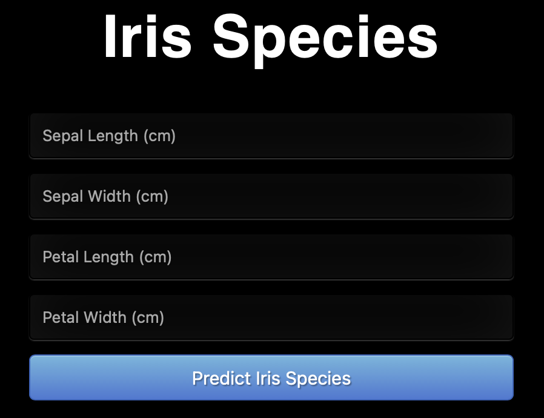

# Flask-WebAPI
Using Flask to interact with a machine learning model through a web API .

# Table of Contents

* [Introduction](#introduction)
* [Requirements](#requirements)
* [Installation](#installation)
* [Usage](#usage)
* [References](#references)
* [License](#license)

## Introduction
A web API allows for information or functionality to be manipulated by other programs via the internet. Machine learning models can be deployed, hosted on a server, and interacted with through a web API. Flask is an API of Python that allows us to build up web-applications. In this project, I have built a web API using Flask. Through the web API, I can receive the classification of an iris flower based on the input parameters. I can also access the web API through Python and R individually. Using Flask is a great way of deploying a machine learning model and allow users to interact with it.

## Requirements
Iris-Flask-WebAPI requires the following to run:

### Python
  * [pandas][pandas]
  * [scikit-learn][scikit-learn]
  * [seaborn][seaborn]
  * [matplotlib][matplotlib]
  * [pickle][pickle]
  * [numpy][numpy]
  * [flask][flask]
  * [requests][requests]

### R
* [httr][httr]
* [jsonlite][jsonlite]

[pandas]: https://pandas.pydata.org
[scikit-learn]: https://scikit-learn.org/stable/
[seaborn]: https://seaborn.pydata.org
[matplotlib]: https://matplotlib.org
[pickle]: https://docs.python.org/3/library/pickle.html#module-pickle
[numpy]: https://numpy.org
[flask]: https://flask.palletsprojects.com/en/1.1.x/
[requests]:https://requests.readthedocs.io/en/master/
[httr]: https://cran.r-project.org/web/packages/httr/index.html
[jsonlite]: https://cran.r-project.org/web/packages/jsonlite/index.html

## Installation

```bash
$ git clone https://github.com/Ce11an/Iris-Flask-WebAPI.git
```

## Usage

### Flask Web API

To start the Flask app, set your command-line working directory as the `predict_iris` folder:

```bash
$ cd your_path/Iris-Flask-WebAPI/predict_iris/
```

Secondly, run the `iris_flask.py` file:

```bash
$ python iris_flask.py
```

Thirdly, the app should be running on `http://127.0.0.1:5000/` (your local-host, port 5000). Copy and paste the link into your browser. The web app should look like the below example:



Add in your values and click the blue predict button. The web app should look like this:


**Please Note** I have used `LinearDiscriminantAnalysis()` model for this project with a `MinMaxScaler`. You may find that you need to re-save the pickle files. This can be done by running the `iris_analysis_model.ipynb` file.

### Requesting Data

`Python_request.py`

With the Flask app running, in a new command-line, set your working directory as the `request_iris` folder

```bash
$ cd your_path/Iris-Flask-WebAPI/request_iris/
```

To run the `Python_request.py` script, use the following:

```bash
$ python Python_request.py
```

Using the default script values the output will be `setosa`

`R_request.R`

Using an R IDE (RStudio for myself) set your working directory as:

```r
setwd("your_path/Iris-Flask-WebAPI/request_iris/")
```

Run the script. Using the default script values the output will be `virginica`


## References
<a id="1">[1]</a>
Sagar, A. 2019. How to Easily Deploy Machine Learning Models Using Flask. Available at: https://towardsdatascience.com/how-to-easily-deploy-machine-learning-models-using-flask-b95af8fe34d4 [Accessed: 7 March 2021].

## License
Iris-Flask-WebAPI is licensed under the [MIT](#) license.  
Copyright &copy; 2021, Rowan Manning
